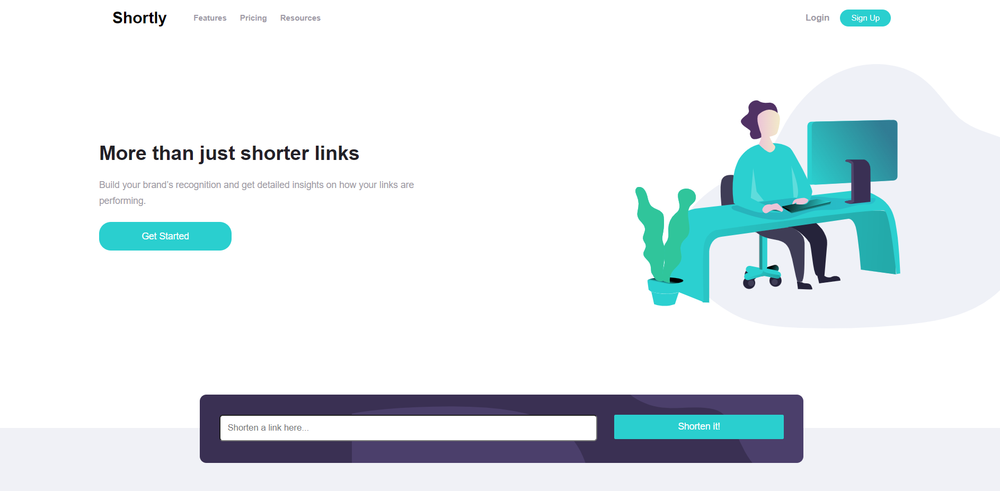
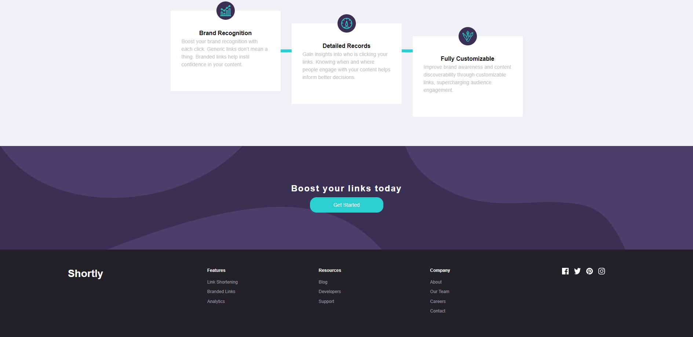
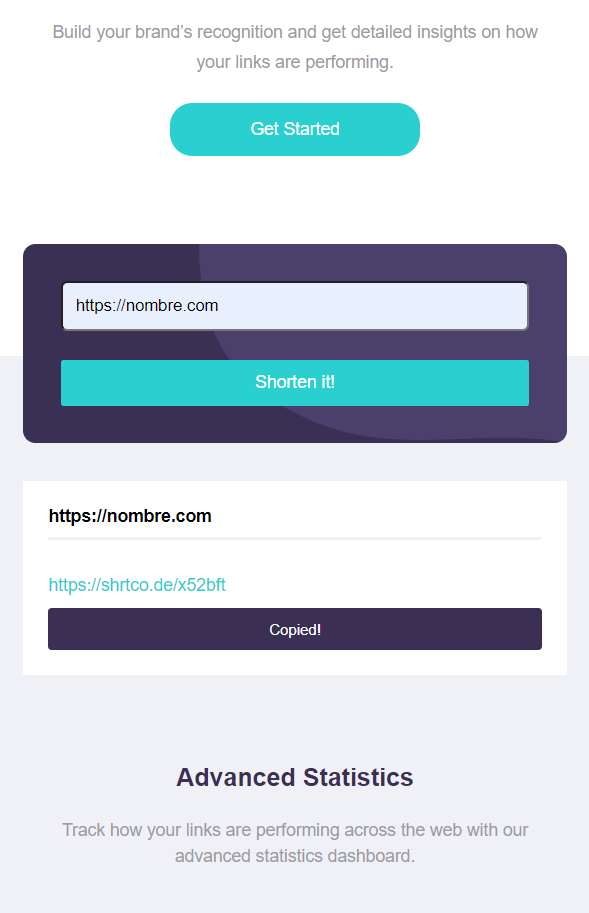
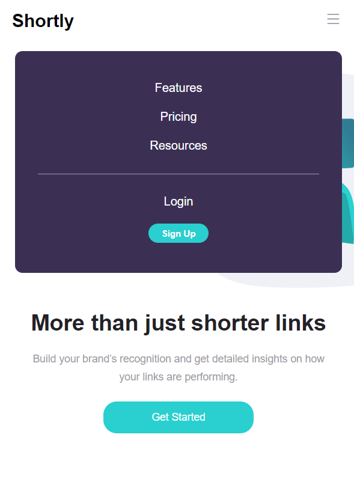

# Frontend Mentor - Shortly URL shortening API Challenge solution

This is a solution to the [Shortly URL shortening API Challenge challenge on Frontend Mentor](https://www.frontendmentor.io/challenges/url-shortening-api-landing-page-2ce3ob-G). Frontend Mentor challenges help you improve your coding skills by building realistic projects. 

## Table of contents

- [Overview](#overview)
  - [The challenge](#the-challenge)
  - [Screenshot](#screenshot)
  - [Links](#links)
- [My process](#my-process)
  - [Built with](#built-with)

  - [Continued development](#continued-development)

- [Author](#author)

**Note: Delete this note and update the table of contents based on what sections you keep.**

## Overview

### The challenge

Users should be able to:

- View the optimal layout for the site depending on their device's screen size
- Shorten any valid URL
- See a list of their shortened links, even after refreshing the browser
- Copy the shortened link to their clipboard in a single click
- Receive an error message when the `form` is submitted if:
  - The `input` field is empty

### Screenshot

### Links

- Solution URL: [Add solution URL here](https://github.com/Roberto-1998/url-shorting)
- Live Site URL: [Add live site URL here](https://url-shorting-peach.vercel.app/)

## My process

### Built with

- Semantic HTML5 markup
- CSS custom properties
- Flexbox
- Mobile-first workflow
- [React](https://reactjs.org/) - JS library
- [Styled Components](https://styled-components.com/) - For styles
- React-query
- React Hook Form
- Yup schema validation

### Continued development

Use this section to outline areas that you want to continue focusing on in future projects. These could be concepts you're still not completely comfortable with or techniques you found useful that you want to refine and perfect.

- React-Query
- React Hook Form
- Yup validation

## Author

- Frontend Mentor - [@Roberto-1998](https://www.frontendmentor.io/profile/Roberto-1998)

